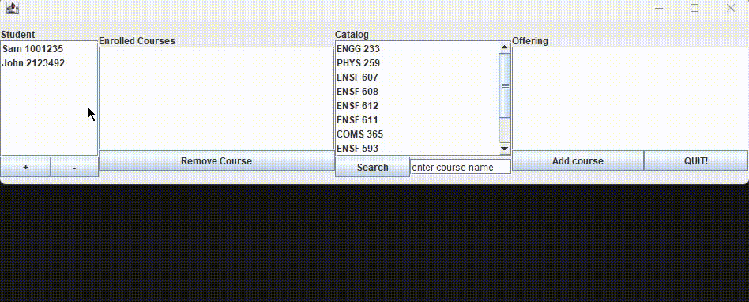

# Student Registration System with MVC

Student registration system developed as an project for the university course. 

## Objective

The objective of this project was to:

- Develop student registration system application that follows the Model-View-Controller (MVC) architectural pattern, based on given requirements.
- Develop a GUI for the application.
- Provide UML diagrams to illustrate the design of the system.

## Project Structure

The project is organized into three packages to adhere to the MVC pattern:

1. **Model**: This package contains the core logic and data structures of the student registration system. It represents the application's data and business logic. Any changes to data and application state occur in this package.

2. **View**: The View package is responsible for the graphical user interface. It is the presentation layer that interacts with the user, displaying information and receiving user input. This package is where the GUI components are implemented.

3. **Controller**: The Controller package acts as an intermediary between the Model and View. It handles user input from the View, processes it, and updates the Model accordingly. It also manages the flow of data between the Model and the View.

## Demo

Here's a demonstrating how the Student Registration System:

## Getting Started

To run and test the Student Registration System with MVC, follow these steps:

1. Clone this repository to your local machine.
2. Open the project in your preferred Java IDE.
3. Build and run the project.
